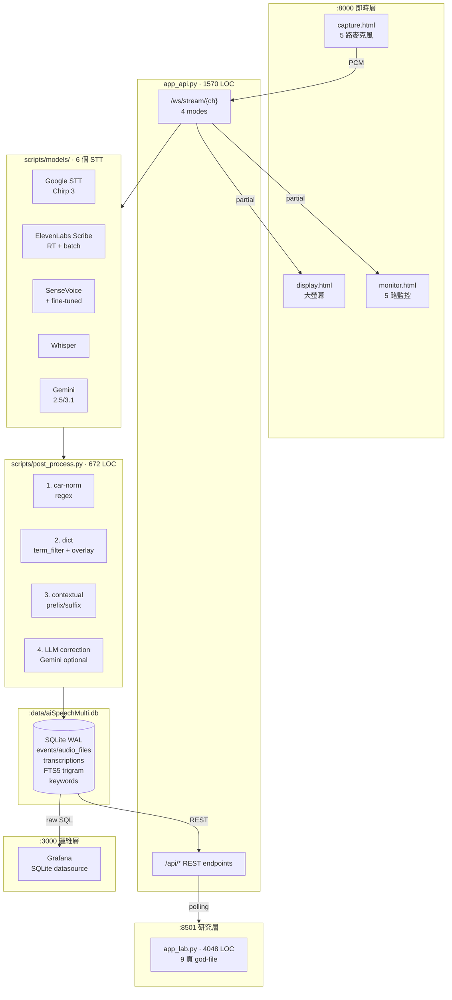

# aiSpeechMulti 架構審視報告

> **日期**：2026-05-07
> **審視範圍**：專案目的、整體架構、程式碼結構、資料流、資料儲存
> **方法**：code-review-and-quality 五軸評估 + senior-architect 結構診斷
> **嚴重度**：Critical（風險高、應立即處理）/ Important（架構債、半年內處理）/ Suggestion（技術債、有空再做）/ FYI（規劃時注意）

---

## 1 · 專案目的與規劃

**用途**：台北捷運（推測）OCC 控制中心**五路無線電**對話即時辨識系統，支援多 STT 引擎評測 + LLM 後修正 + 黃金語料 CER 追蹤。

**三層介面**（根據 [INTERFACES.md](./INTERFACES.md)）：

| 層 | 介面 | 入口 | 用戶 | 更新 |
|---|---|---|---|---|
| 即時 | FastAPI + 4 個靜態 HTML（landing/capture/monitor/display） | `:8000` | 場域、操作員、控制室 | 毫秒級 WebSocket |
| 研究 | Streamlit Lab（9 頁） | `:8501` | 開發、評測 | 互動觸發 |
| 運維 | Grafana | `:3000` | SRE | 分鐘級輪詢 |
| 跨層 | 統一 CLI | `python -m aispeech` | 自動化 | 一次性 |

**當前主力**：gemini-2.5-pro（CER 48.03%，含 overlay + preproc），備援 SenseVoice-FT（離線）。

**規劃路線**（`WORKLOG_2026-04-29.md`）：

- 介面整併 P0~P3 **已完成**（5/4 拆 dashboard / FastAPI 路由整理 / 統一 CLI / Vocab API）
- design-system 6/6 上週完成（dark-cool + dark-warm 雙主題）
- TODO：confidence 標記、initial_prompt 強化、版本管理（DB schema raw/dict/final 五欄）

---

## 2 · 程式架構評估

### 2.1 整體拓撲



### 2.2 五軸評估

| 軸 | 評分 | 主要發現 |
|---|---|---|
| **Correctness** | B+ | 已通過真實場景驗證（63 段黃金集 CER 48%）。但無自動化測試 ⚠️ |
| **Readability** | B- | 大量繁中註釋、變數名清楚；但兩個 god-file（app_lab 4048 LOC、app_api 1570 LOC）阻礙閱讀 |
| **Architecture** | C+ | 三層分離清楚 + CLI 收斂、但缺 **STT 引擎抽象層**、god-file 模組化未做、無 schema migration |
| **Security** | C | `.env` 含明文 ElevenLabs key、硬編碼 GCP project ID 在 8 個檔案、API key 路徑跨 project 錯誤、search 端點疑似 f-string SQL injection 風險 🚨 |
| **Performance** | B | WAL + FTS5 trigram 設計合理、log rotation 有；但無 Prometheus/OTel、Grafana 直查 SQLite |

---

## 3 · 資料流評估

### 3.1 即時模式（dual mode）

```
Browser × 5 (Web Audio API)
    │ PCM frames (16kHz mono)
    ▼ WebSocket /ws/stream/{1-5}?mode=dual
FastAPI asyncio dispatcher
    ├─→ Scribe v2 RT WebSocket  ──→ partial → 前端  (~150ms TTFT)
    └─→ AudioBuffer (15s)        ──→ Google STT chirp_3 → confirmed
                                            │
                                            ▼
                                    post_process.py
                                    (car_norm → dict → contextual → LLM optional)
                                            │
                                            ▼
                                    SQLite + FTS5 manual sync
```

### 3.2 評測 / 批次模式

```
manifest.csv (golden_dataset)
    │
    ▼
batch_stt_eval.py (× 6 engines)  →  experiments/golden_dataset/stt_outputs/{engine}/{id}.txt
                                            │
                                            ▼
                                    eval_groundtruth.py × 4 後處理組合
                                            │
                                            ▼ batch_eval_*.json
                                    build_cer_index.py  →  cer_history.csv (append-only)
                                            │
                                            ▼ python -m aispeech data sync-cer
                                    SQLite cer_history table  →  Grafana
```

### 3.3 資料流問題

| # | 嚴重度 | 問題 |
|---|---|---|
| D1 | **Important** | **同一份 cer_history 存兩處** — CSV (single source of truth) 和 SQLite (Grafana 用)。同步靠手動 `data sync-cer`。如果忘了同步 Grafana 看到舊數據 → 決策誤導 |
| D2 | **Important** | FTS5 用「應用層手動同步」而非 SQLite TRIGGER（`db_manager.py` 註解承認是 Streamlit threading workaround）。某次 `save_transcription()` 失敗 FTS5 會悄悄漏掉，搜尋結果不全 |
| D3 | Suggestion | dual 模式裡 Scribe RT 推 partial 給前端但**不入 DB**，Google batch confirmed 才入 DB。若 Google 失敗，partial 的字就永久丟了——沒有 fallback 入庫機制 |
| D4 | FYI | post_process 三段都會留 audit trail（changes list），這是優點，建議寫成 DB 一行附加欄位「post_process_audit JSON」方便溯源 |

---

## 4 · 資料儲存評估

### 4.1 目前 schema（從 `utils/db_manager.py` 抽取）

```sql
events (id, event_name, event_date, model_type, sub_model, hazard_level, notes, created_at)
audio_files (id, event_id FK, original_filename, archive_path, file_hash, file_size, recorded_at, created_at)
transcriptions (id, audio_file_id FK, event_id FK, transcript, status, error_message, use_vad, use_denoise, created_at)
transcriptions_fts VIRTUAL fts5(transcript, tokenize='trigram')
keywords (id, event_id FK, transcription_id FK, keyword, source, hazard_level, created_at)
```

**設計合理之處**：

- ✓ WAL mode（並發讀寫）
- ✓ 外鍵開啟（referential integrity）
- ✓ FTS5 trigram tokenize 對中文 ≥ 3 字搜尋很對胃口
- ✓ 5 個 index 都打在 FK 上，常見查詢覆蓋

### 4.2 儲存層問題

| # | 嚴重度 | 問題 |
|---|---|---|
| S1 | **Critical** | **無 schema migration 機制**。整個 schema 由 `_init_schema()` 內嵌 DDL，欄位變更需要手動 SQL ALTER。WORKLOG 已提到「TODO: DB schema 加 raw/after_dict/final 五欄」——再加就會炸 |
| S2 | **Important** | `data/aiSpeech.db`（60KB）和 `data/aiSpeechMulti.db`（1.9MB）並存，前者**程式碼從不打開**——是死檔，但占空間並造成混淆 |
| S3 | **Important** | `transcriptions` 表**沒有引擎欄位**——多引擎跑分結果都塞在 `audio_files.event_id` 下，分析時要 join `events.sub_model`。引擎變多會漏掉 |
| S4 | **Important** | WORKLOG 04-29 提到「`transcriptions` 加 `corrected_transcript` / `corrected_at` / `engine_hint`」——這些欄位已在 Dashboard 修正流用，但目前 schema DDL 沒看到，需要確認是否已 ALTER 上去 |
| S5 | Suggestion | `requirements.txt` 列了 `psycopg2-binary` + `sqlalchemy`，**實際用 raw sqlite3**。要嘛是未來 PG 計畫（那就在 README 寫清楚），要嘛是殘留依賴（拿掉省空間） |
| S6 | Suggestion | 沒有 `created_at` 自動 `INSERT OR REPLACE` 防呆；批次匯入若 audio_file_id 已存在會失敗或重複 |
| S7 | FYI | hazard_level 用 INTEGER（推測 0~4 等級），建議用 CHECK constraint 鎖範圍 + 用 `_VOCAB.md` 對照表記錄各值含義 |

---

## 5 · 妥善之處（先肯定）

別只挑毛病——以下做得**非常好**：

1. **🏆 介面整併 P0~P3 是高水準工程**：把 monolithic dashboard 拆成「即時/研究/運維」三層 + 統一 CLI，並保留 30 天 deprecation 期，過渡平滑
2. **🏆 資料飛輪閉環設計**：人工修正 → DB → export → overlay → 下次 CER 降——這是 CER 從 49% 持續優化的根本機制，比改演算法重要
3. **✓ Engine-specific overlay 架構**（v2.0）：實證每引擎錯字 pattern 不同後拆基底 + overlay，避免規則互打
4. **✓ Audio preprocessing 差異化**：發現 chirp3/scribe 內建 frontend AGC 後，做 per-engine `audio_preprocess.enabled` 路由——是負面結果驅動的好決策
5. **✓ INTERFACES.md 是優秀的架構文件**——任何新人 5 分鐘讀完知道哪個 port 對哪個 UI 對哪個用戶
6. **✓ CLI thin-wrapper 設計**：不重寫舊 scripts，只 subprocess 透傳——保留向後相容、零維護成本
7. **✓ WORKLOG 質量極高**：每天條列 commit + Δ CER + 重大發現 + 隔天 TODO，外部 reviewer 能 1 小時掌握 6 週進展
8. **✓ Regression case 抽取工具**：主動驗證後處理沒把對的字改錯——0 真誤殺對 = 規則庫自動化安全

---

## 6 · 需要調整 / 優化（按優先級排）

### 🚨 Critical（風險高、應儘快處理）

| # | 問題 | 推薦動作 |
|---|---|---|
| C1 | **`.env` 含明文 ElevenLabs key** + 硬編碼路徑指向不存在的 `/Users/apple/Projects/aiSpeech/utils/google-speech-key.json` | 撤換 ElevenLabs key（已外洩到本機檔案，雖未進 git）；改用 `.env.example` 模板 + 把實際 .env 撤底重生 |
| C2 | **search 端點疑似 f-string 拼 SQL → injection 風險** | 立即審 `app_api.py` 內所有 `cursor.execute(f"...")`，改參數化 |
| C3 | **無 schema migration**，下個 schema 變更會炸 | 引入 [Alembic](https://alembic.sqlalchemy.org/) 或自寫 `migrations/00X_*.sql` + 版本表 |
| C4 | **零自動化測試**，CER 評測雖跑得勤但 unit/integration test 全靠手動 `test_*.py` | 加 `pytest` + 對 post_process 三階段、cer_engine 寫 ≥ 30 個 unit test。CI 跑（GitHub Actions） |

### ⚠️ Important（架構債、半年內處理）

| # | 問題 | 推薦動作 |
|---|---|---|
| I1 | **無 STT 引擎抽象層**——6 個 model_*.py 各有不同方法名、return shape | 定義 `STTEngine` Protocol（abc 或 typing.Protocol）：`transcribe_file(path, **opts) -> TranscriptionResult`，TranscriptionResult 是 dataclass，每引擎 wrap 進去 |
| I2 | **app_lab.py 4048 LOC god-file** | 拆 `pages/`：每頁一個 `pages/speech.py`、`pages/evaluation.py` ... 共用元件進 `pages/_components.py`。Streamlit 1.28+ 原生支援 `pages/` 自動發現 |
| I3 | **app_api.py 1570 LOC** 也偏大 | 拆 `routers/`：channels.py / transcripts.py / vocabulary.py / health.py。FastAPI 原生 APIRouter 機制 |
| I4 | **transcriptions 缺 engine 欄位 / corrected_transcript 欄位狀況不明** | S3 + S4 一起做：把 04-29 worklog 提到的修正欄位確認/補上去，加 engine_hint NOT NULL |
| I5 | **GCP project ID `dazzling-seat-315406` 硬編碼在 8 處** | 改成讀 `os.getenv("GCP_PROJECT_ID")` + 啟動時驗證；單一 `utils/config.py` 集中 |
| I6 | **離線模式規劃/ 是 fork 出去的另一份 app.py**——維護負擔 | 兩個選擇：(a) merge 回主程式用 `--mode offline` 切；(b) 明確標記為 prototype 並從主路徑刪 |

### 💡 Suggestion（技術債、有空再做）

| # | 問題 | 推薦動作 |
|---|---|---|
| Sg1 | 死檔 `data/aiSpeech.db`（60KB） | 確認真的沒人用後 `git rm` |
| Sg2 | 9 個 WORKLOG_*.md 在 project root | 移到 `docs/devlog/` 或 `_devlog/`，root 留 README.md（**目前沒有 README**！這是必補的） |
| Sg3 | `requirements.txt` 列 psycopg2 + sqlalchemy 但沒用 | 拿掉或在註解寫清楚「未來 PG 遷移用」 |
| Sg4 | logs/ 1154 個檔，rotation 5 backup × 10MB max | 已有 rotation 算 OK，但加 `logs/.gitignore` 確認不入 git（gitignore 有 `logs/`，OK） |
| Sg5 | utils/api_keys.json 同時有 .json + .json.template + 文檔提到 .py 版本 | 統一一個入口，刪掉備援路徑（.py 變數版本太脆弱） |
| Sg6 | gemini-3.1-pro-preview 跑分差但 code 仍保留 | 標 deprecated 或刪，避免下次有人誤用 |

### 📌 FYI（規劃時注意）

- **CER 49% 是窄頻無線電的物理上限附近**——不要對單一引擎期望降到 < 30%；繼續走 ensemble + LM rescore + 規則庫飛輪策略對
- **fine-tuned SenseVoice 是低成本高 ROI 賭注**——已在跑，繼續
- **未來上 Prometheus/OTel** 不必急（Grafana 直查 SQLite 對單機足夠）；只在多機部署時才需要
- **無 Dockerfile**——目前單機 OK，但要部署到第二台機器時必補

---

## 7 · 推薦行動順序（如果只能挑 5 件做）

```
Week 1
  □ C1 撤換洩漏的 ElevenLabs key + 修 .env 路徑
  □ C2 審 SQL f-string，改參數化
  □ Sg2 加 README.md（最少 100 行：what / why / how to run / dir layout）

Week 2-3
  □ C3 引入 schema migration（Alembic 或自寫 numbered SQL）
  □ I4 補上 engine_hint + corrected_transcript 欄位（如未補）

Month 2
  □ C4 pytest + 30 個 unit test for post_process / cer_engine
  □ I1 STT 引擎抽象層（最大架構整理）

Month 3+
  □ I2/I3 拆 god-file
  □ I6 處理離線模式規劃 fork
```

---

## 8 · 結論

**整體判斷：B+ 的工程品質，B- 的架構**。

**強項**：資料飛輪設計優秀、介面整併執行力高、文檔（INTERFACES + WORKLOG）屬產業上層級、CER 優化有方法論。

**弱項**：缺自動化測試 / migration / 抽象層三大基礎設施；安全衛生不夠嚴；god-file 累積技術債。

**這不是個「需要重寫」的專案**——它是一個**運作良好、需要補基礎工程**的專案。先處理 4 條 Critical 把風險面清掉，I1 + I2 在下一個 sprint 規劃進去，其他可以隨手帶。

---

*審視者：Claude Opus 4.7 (1M context)*
*方法依據：projectArea Skill Routing Protocol（task_type=architecture_task）*
*相關工作日誌：[WORKLOG_2026-04-29.md](../WORKLOG_2026-04-29.md)、[INTERFACES.md](./INTERFACES.md)*
